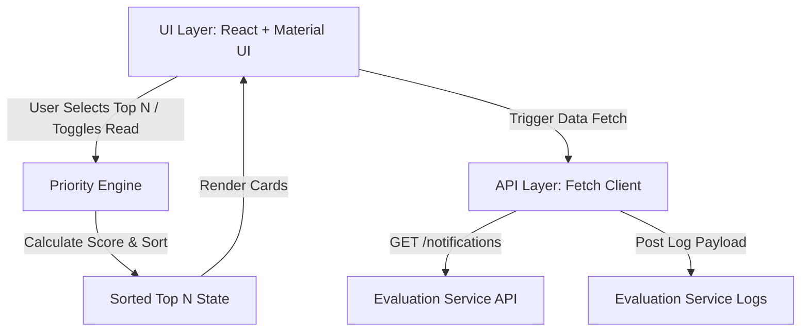

# Stage 1

## Objective

The objective is to design and build a production-ready, highly responsive Priority Inbox system for campus notifications. The system dynamically prioritizes incoming announcements so that critical alerts (such as Placements, Exam Results, and major Events) are showcased prominently to the student body, while factoring in recency and read/unread status.

## Architecture

The system follows a modular, decoupled three-tier architecture:

### 1. API Layer
- Wraps all remote asynchronous HTTP operations.
- Intercepts requests to inject Bearer Token Authorization from environment configurations.
- Interfaces with the custom logging middleware to transmit status payloads on success and failure.

### 2. Priority Engine
- Calculates dynamic priority scores for each notification on-the-fly.
- Sorts the collection in descending order of priority scores and slices the list to return the top `N` notifications.
- Triggered inside React's reactive cycle using `useMemo` hooks to avoid redundant computations on minor component updates.

### 3. UI Layer
- Uses Material UI (MUI) for a premium, responsive responsive grid system.
- Separated into specialized components: Header (AppBar), TopNSelector, NotificationCard, and NotificationList.
- Handles various lifecycle states: Loading skeleton loader animations, descriptive empty inbox screens, and full API error messages with retry options.

## Priority Algorithm

The priority score is calculated dynamically using the following formula:

$$\text{priorityScore} = \text{weight} + \text{recencyScore} + \text{unreadBonus}$$

### Parameters and Constants:

1. **Weight**: Based on notification category importance:
   - **Placement** = 100
   - **Result** = 80
   - **Event** = 60
   - **Default** = 40

2. **Recency Score**: Linear decay of relevance over time:
   - Calculated as: $\text{recencyScore} = \max(0, 100 - \text{ageInHours})$
   - A brand new notification receives 100 points, decaying by 1 point per hour, reaching 0 after 100 hours (~4.16 days).

3. **Unread Bonus**: Prioritizes unread communications:
   - **Unread** = +50 points
   - **Read** = 0 points

### Example Priority Scenarios:
- **Scenario A**: An unread Placement notification received 2 hours ago:
  $$\text{Score} = 100 + (100 - 2) + 50 = 248.0$$
- **Scenario B**: A read Event notification received 10 hours ago:
  $$\text{Score} = 60 + (100 - 10) + 0 = 150.0$$

## Complexity Analysis

Let $N$ be the total number of notifications returned by the API and $K$ be the user-selected limit (Top 10, 15, or 20).

### Time Complexity:
- **Priority Calculation**: Calculating the score for a single notification takes $O(1)$ time. For $N$ notifications, the score calculation phase is $O(N)$.
- **Sorting**: Sorting the $N$ scored notifications in descending order takes $O(N \log N)$ using modern JavaScript V8 sorting engines.
- **Slicing**: Slicing the top $K$ elements takes $O(K)$.
- **Total Time Complexity**: $O(N \log N)$ (since $K \ll N$ and sorting dominates). This runs in milliseconds for thousands of records.

### Space Complexity:
- **Temporary Arrays**: Creating a shallow copy of the notifications list with attached `priorityScore` requires $O(N)$ extra space.
- **Top N Slice**: Slicing and rendering takes $O(K)$ space.
- **Total Space Complexity**: $O(N)$ auxiliary space.

## Logging Strategy

The logging system utilizes a reusable middleware (`logger.ts`) that POSTs log payloads to the endpoint: `http://20.244.56.144/evaluation-service/logs`

### Log Payload Structure:
- `stack`: Literal `'frontend'`.
- `level`: `'debug' | 'info' | 'warn' | 'error' | 'fatal'`.
- `package` / `packageName`: Specific sub-packages representing the source domain (`api`, `component`, `hook`, `page`, `state`, `style`, `auth`, `config`, `middleware`, `utils`).
- `message`: Descriptive log message.
- `timestamp`: UTC ISO Date string.

### Integrated Triggers:
1. **Page Load**: Fired when `Dashboard` page mounts (`page`/`info`).
2. **Component Render**: Fired on mounting key components (e.g. Header, TopNSelector, Card, List) (`component`/`debug`).
3. **API Success**: Fired when notifications fetch succeeds, logging the fetched count (`api`/`info`).
4. **API Failure**: Fired when fetch fails, logging response status or network details (`api`/`error`).
5. **State Updates**: Fired when notifications array changes, read/unread gets toggled, or top N values change (`state`/`info`).
6. **Priority Calculations**: Fired during each priority score calculation, showing the sub-scores breakdown (`utils`/`debug`).

## Assumptions

1. **Authentication**: The remote API validates requests using standard Bearer Token auth. If `VITE_ACCESS_TOKEN` is absent in production, we fallback gracefully to omit the Authorization header, relying on server configurations.
2. **Data Consistency**: The API returns an array of notifications. The schema might contain `date` or `timestamp`, and read flag might be represented by `read` or `isRead`. The frontend normalizes both variations.
3. **API Availability**: The logging endpoint supports CORS and accept JSON payloads without custom header constraints.
4. **Client Time Sync**: The system relies on local client clock for `Date.now()` calculations when calculating recency scores. If client clock is out of sync, priority rankings remain correct relative to other notifications, though absolute scores may shift.
